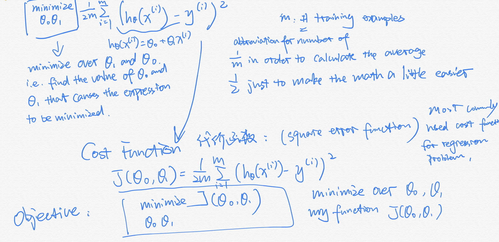
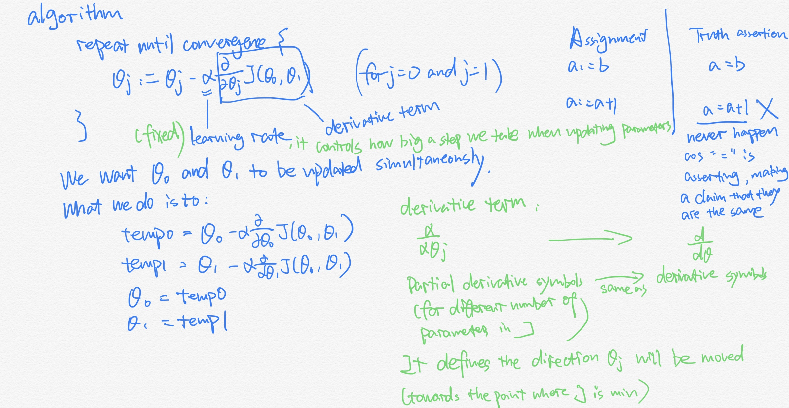
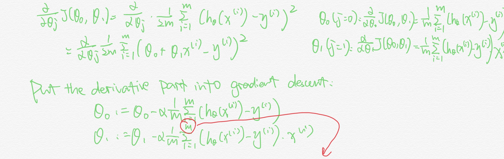

## Supervised learning and unsupervised learning:
### Supervised learning:
  In every example in our data set, we are told what is the “correct answer”. The task of the algorithm is to give a more correct answer
	#### Two common problems related to supervised learning:
	Regression: to predict a continuous-valued output
	Classification: to predict a discreet valued output
### Unsupervised learning: 
  A learning setting where the algorithm is given a ton of data and just asked to find structure in the data for us.

## SOME NOTATION IN THE COURSE:
m = Number of training examples
x = “input” variable/features(e.g. size of the house)
y = “output” variable/“target” variable(e.g. price of the house)
(x,y): a single training example
(x^(i),y^(i)): the i^th training example

## How supervised learning algorithm works:
Training Set  ➡️feed to➡️  Learning Algorithm  ➡️to output➡️  h(hypothesis function)(A function that maps from x’s to y’s)
For linear regression with one variable(x), or called univariate linear regression, h is represented as h_theta (x) = theta_0 + theta_1 x

## Cost function: 
  Usage: help to figure out how to fit the best possible straight line to our data.
  h_theta (x) = theta_0 + theta_1 x is the hypothesis function in linear regression, where theta_0 and theta_1 are parameters. Different parameters lead to different hypothesis function. So the point is how to choose them.
 
 
## Gradient descent:
  Usage: to minimize the cost function J.  
  
### How to apply gradient descent algorithm into our cost function(linear regression model)?  

The type of gradient descent we used is called “Batch” Gradient descent. It means each step of gradient descent uses all the training examples. (i.e. m in sigma)
